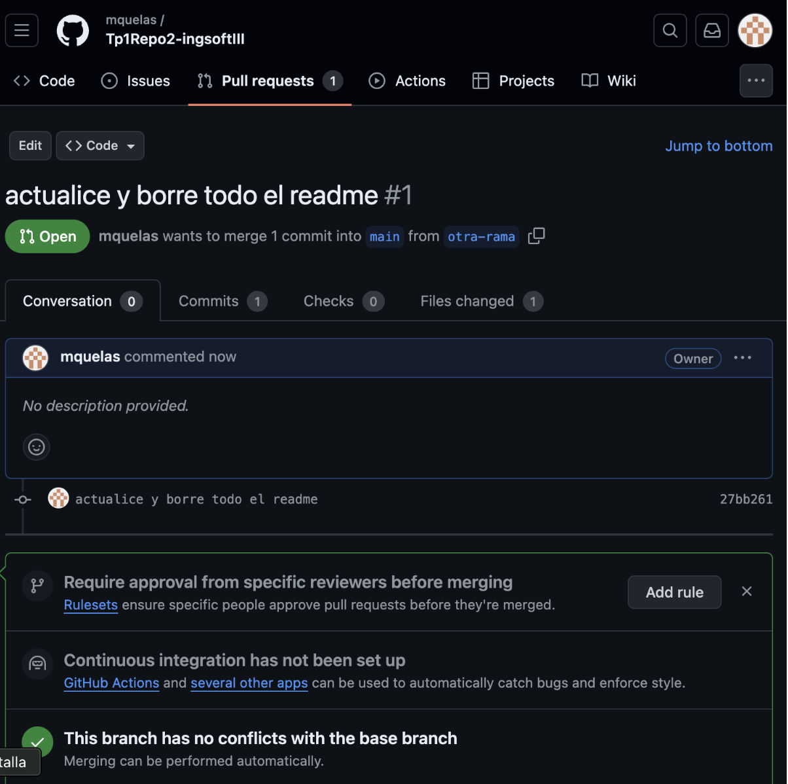

Quelas,Maximiliano
Ingeniería de software III
###TP1 :”Github”

#1- Instalar Git
Los pasos y referencias asumen el uso del sistema operativo Windows, en caso otros SO seguir recomendaciones específicas.
Bajar e instalar el cliente git. Por ejemplo, https://git-for-windows.github.io/
Bajar e instalar un cliente visual. Por ejemplo, TortoiseGit para Windows o SourceTree para Windows/MAC:
https://tortoisegit.org/
https://www.sourcetreeapp.com/
Lista completa: https://git-scm.com/downloads/guis/      Listo

#2- Crear un repositorio local y agregar archivos
Crear un repositorio local en un nuevo directorio.
Agregar un archivo Readme.md, agregar algunas líneas con texto a dicho archivo.
Crear un commit y proveer un mensaje descriptivo.

#3- Configuración del Editor Predeterminado
Instalar Notepad ++ para Windows o TextMate para Mac OS, colocarle un alias y configurarlo como editor predeterminado          Listo

#4- Creación de Repos 01 -> Crearlo en GitHub, clonarlo localmente y subir cambios
Crear una cuenta en https://github.com
Crear un nuevo repositorio en dicha página con el Readme.md por defecto
Clonar el repo remoto en un nuevo directorio local
Editar archivo Readme.md agregando algunas lineas de texto
Editar (o crear si no existe) el archivo .gitignore agregando los archivos *.bak
Crear un commit y proveer un mensaje descriptivo
Intentar un push al repo remoto

En caso de ser necesario configurar las claves SSH requeridas y reintentar el push.

#5- Creación de Repos 02-> Crearlo localmente y subirlo a GitHub
Crear un repo local
Agregar archivo Readme.md con algunas lineas de texto
Crear repo remoto en GitHub
Asociar repo local con remoto
Crear archivo .gitignore
Crear un commit y proveer un mensaje descriptivo
Subir cambios.

#6- Ramas
Crear una nueva rama
Cambiarse a esa rama
Hacer un cambio en el archivo Readme.md y hacer commit
Revisar la diferencia entre ramas

#7- Merges
Hacer un merge FF
Borrar la rama creada
Ver el log de commits
Repetir el ejercicio 6 para poder hacer un merge con No-FF

#8- Resolución de Conflictos
Instalar alguna herramienta de comparación. Idealmente una 3-Way:
P4Merge https://www.perforce.com/downloads/helix-visual-client-p4v: alt text
Se puede omitir registración. Instalar solo opción Merge and DiffTool.
ByondCompare trial version https://www.scootersoftware.com/download.php
Configurar Tortoise/SourceTree para soportar esta herramienta.
https://www.scootersoftware.com/support.php?zz=kb_vcs
https://medium.com/@robinvanderknaap/using-p4merge-with-tortoisegit-87c1714eb5e2
Crear una nueva rama conflictBranch
Realizar una modificación en la linea 1 del Readme.md desde main y commitear
En la conflictBranch modificar la misma línea del Readme.md y commitear
Ver las diferencias con git difftool main conflictBranch
Cambiarse a la rama main e intentar mergear con la rama conflictBranch
Resolver el conflicto con git mergetool
Agregar .orig al .gitignore
Hacer commit y push

#9- Familiarizarse con el concepto de Pull Request
Explicar que es un pull request.

Es una solicitud para que los cambios realizados en una rama (branch) sean revisados y fusionados (merged) en otra rama, típicamente en la rama principal del repositorio, como main o master

Crear un branch local y agregar cambios a dicho branch.
Subir el cambio a dicho branch y crear un pull request.
Completar el proceso de revisión en github y mergear el PR al branch master.
\

#10- Algunos ejercicios online
Entrar a la página https://learngitbranching.js.org/
Completar los ejercicios Introduction Sequence
Opcional - Completar el resto de los ejercicios para ser un experto en Git!!!

#11- Crear Repositorio de la materia
Crear un repositorio para la materia en github. Por ejemplo ing-software-3
Subir archivo(s) .md con los resultados e imágenes de este trabajo práctico. Puede ser en una subcarpeta trabajo-practico-01  Listo
