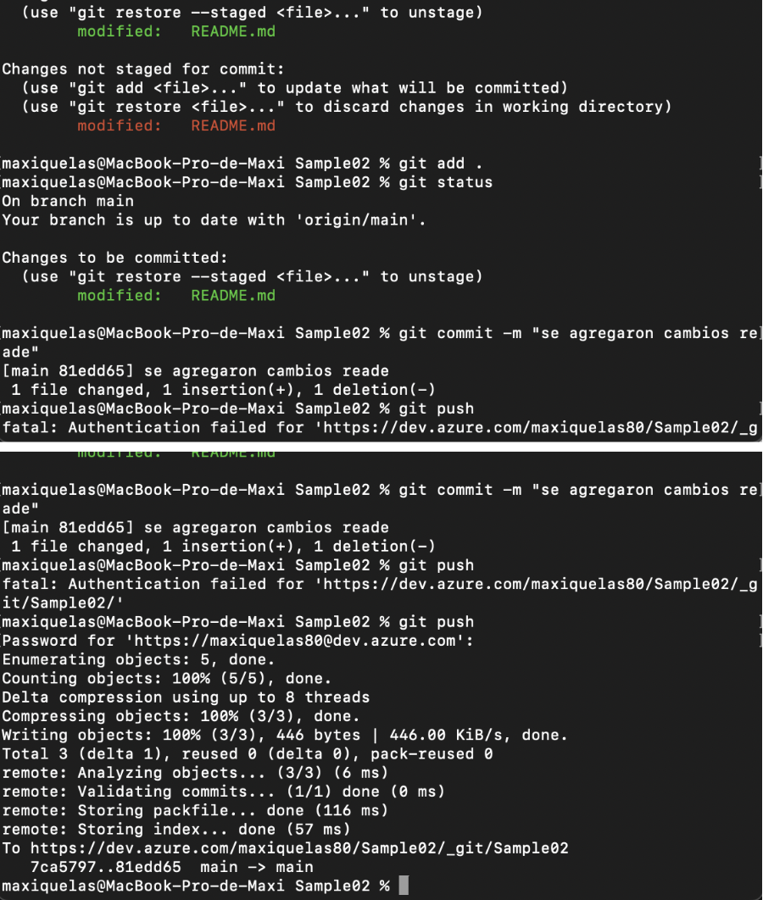

Quelas,Maximiliano
Ingeniería de software III

### TP3 :”Azure Devops”

# 1- Objetivos de Aprendizaje
Familiarizarse con la plataforma Azure Devops

# 2- Consignas a desarrollar en el trabajo práctico:
¿Qué es Azure DevOps?
-Azure DevOps es un conjunto de herramientas y servicios proporcionado por Microsoft para la gestión del ciclo de vida del desarrollo de software. Está diseñado para ayudar a los equipos de desarrollo a planificar, desarrollar, probar, entregar, y monitorear software de manera eficiente. Azure DevOps facilita la colaboración entre equipos, automatiza flujos de trabajo, y permite la integración continua (CI) y la entrega continua (CD).

Breve descripción de Azure DevOps como un conjunto de herramientas para la colaboración en desarrollo de software.
-Azure DevOps es un conjunto de herramientas de Microsoft para la colaboración en el desarrollo de software, que incluye repositorios de código, integración y entrega continua, gestión de proyectos ágiles, y pruebas automatizadas.

Beneficios de utilizar Azure DevOps en comparación con otras soluciones.
-Azure DevOps ofrece beneficios como integración completa de herramientas, flexibilidad multiplataforma, automatización de flujos de trabajo, integración con herramientas populares, seguridad avanzada, y soporte robusto de Microsoft, lo que lo hace ideal para equipos de desarrollo de cualquier tamaño.

Componentes Principales de Azure DevOps
Azure Repos
Sistema de control de versiones con Git o TFVC.
Funcionalidades clave: branching, pull requests, code reviews.
Azure Pipelines
CI/CD (Integración Continua y Entrega Continua).
Creación y gestión de pipelines para la automatización de build, test y deploy.
Azure Boards
Gestión de proyectos con Kanban y Scrum.
Seguimiento de tareas, bugs, y trabajo en curso.
Azure Artifacts
Gestión de paquetes (NuGet, npm, Maven).
Uso de feeds para compartir artefactos entre equipos.
Azure Test Plans
Herramientas para pruebas manuales y automatizadas.
Gestión de casos de prueba y reportes de calidad.
Integración con otras herramientas

GitHub, Jenkins, Docker, Kubernetes.
Marketplace de extensiones

Añadir funcionalidades adicionales a Azure DevOps.
#3- Pasos del TP
3.1 Crear una cuenta en Azure DevOps
3.2 Crear un proyecto Sample01
3.3 Crear un repo GIT desde cero

3.4 Crear un proyecto Sample02
3.5 Importar un repo desde GitHub: https://github.com/ingsoft3ucc/SimpleWebAPI.git

3.6 Realizar un cambio en un archivo, y subirlo al repo de ADO.

3.7 Crear un pipeline, solicitar acceso a jobs de paralelismo

Nos salta un error 

3.8 Cambiar el tipo de proceso de Basic a Agile

3.8 Crear un sprint

3.9 Crear User Stories

3.10 Crear Tasks y Bugs

# 4- Presentación del trabajo práctico.
Subir un al repo con las capturas de pantalla de los pasos realizados y colocar en el excel de repos (https://docs.google.com/spreadsheets/d/1mZKJ8FH390QHjwkABokh3Ys6kMOFZGzZJ3-kg5ziELc/edit?gid=0#gid=0) la url del proyecto de AzureDevops (
