Quelas,Maximiliano
Ingeniería de software III

### TP7 :”Code Coverage, Análisis estático de Código y Pruebas de Integración”

# 4- Desarrollo:

*Prerrequisitos:*

	4.1 Agregar Code Coverage a nuestras pruebas unitarias de backend y front-end e integrarlas junto con sus resultados en nuestro pipeline de build.
	Desarrollo del punto 4.1:
	4.1.1 En el directorio raiz de nuestro proyecto Angular instalar el siguiente paquete:
	npm install karma-coverage --save-dev

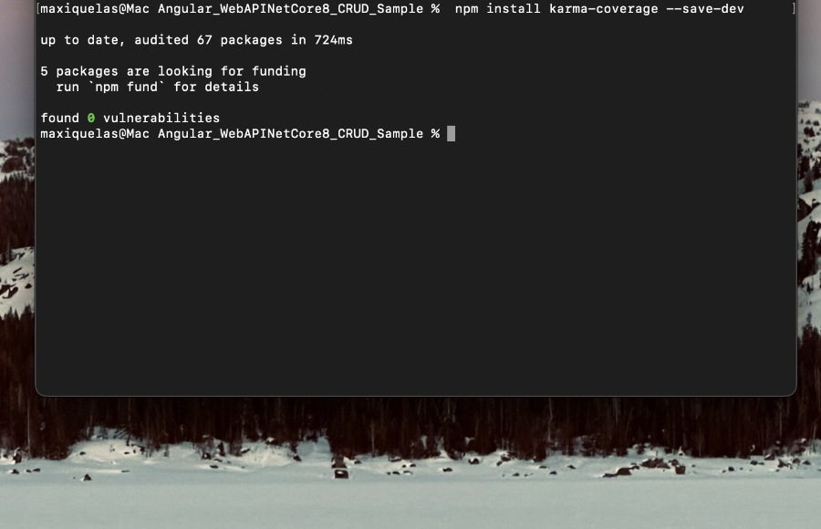

	4.1.2 Editar nuestro archivo karma.conf.js para que incluya reporte de cobertura

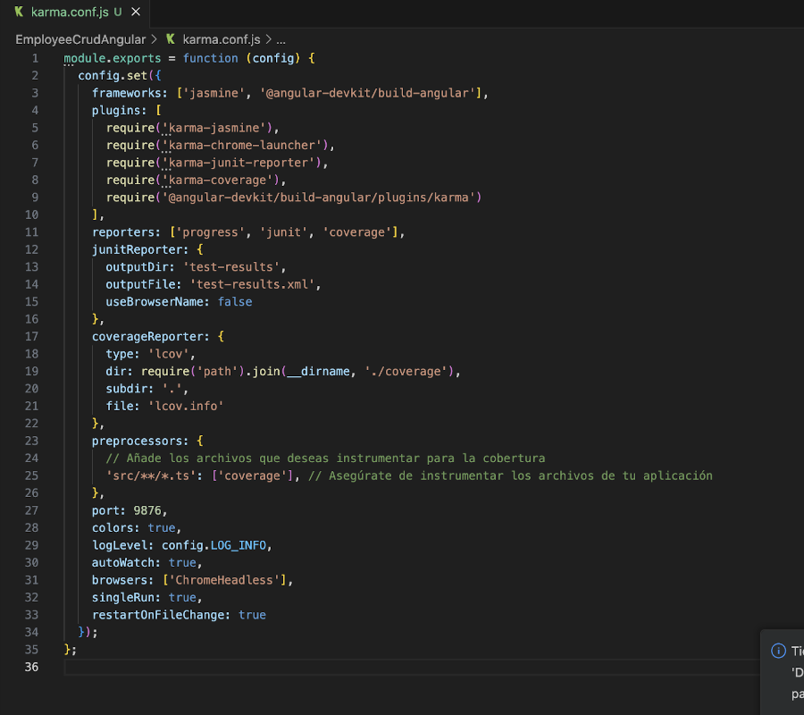

	4.1.3 En el dir raiz del proyecto EmployeeCrudApi.Tests ejecutar:
	dotnet add package coverlet.collector

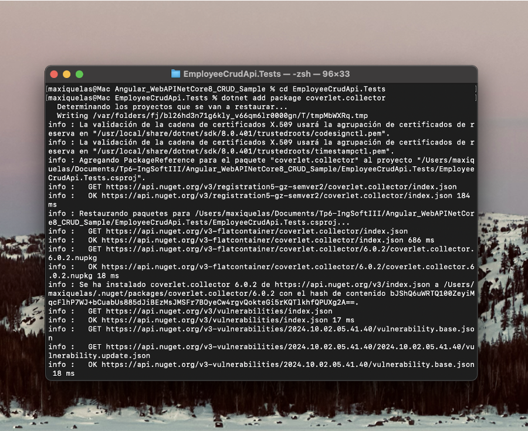

	4.1.4 Agregar a nuestro pipeline ANTES del Build de Back la tarea de test con los argumentos especificados y la de publicación de resultados de cobertura:

-Para poder hacer este paso , ya que todo lo de angular se habia realizado de forma local . Cree un nuevo repositorio donde lo clone a una carpeta local y copie el archivo de angular , en donde , borre los .git .gitignore para poder realizar el push y mis cambios y de ahi realice desde azure projects un nuevo proyecto haciendo un import del repositorio donde se encuentra lon de angular-

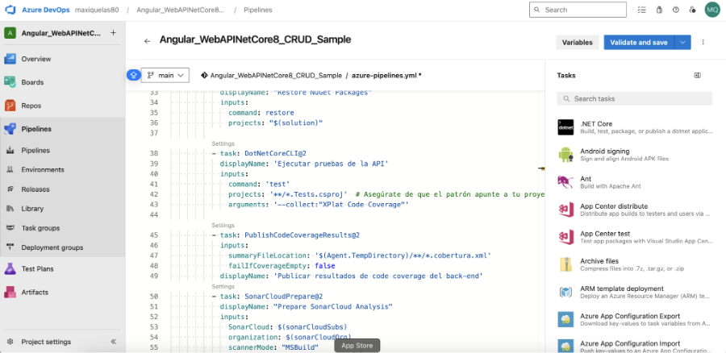

	4.1.5 Agregar a nuestro pipeline ANTES del Build de front la tarea de test y la de publicación de los resultados.

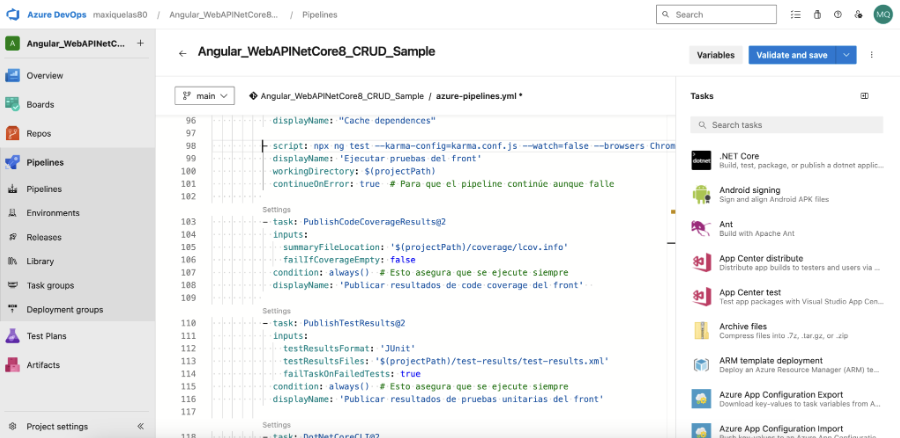

	4.1.6 Ejecutar el pipeline y analizar el resultado de las pruebas unitarias y la cobertura de código.

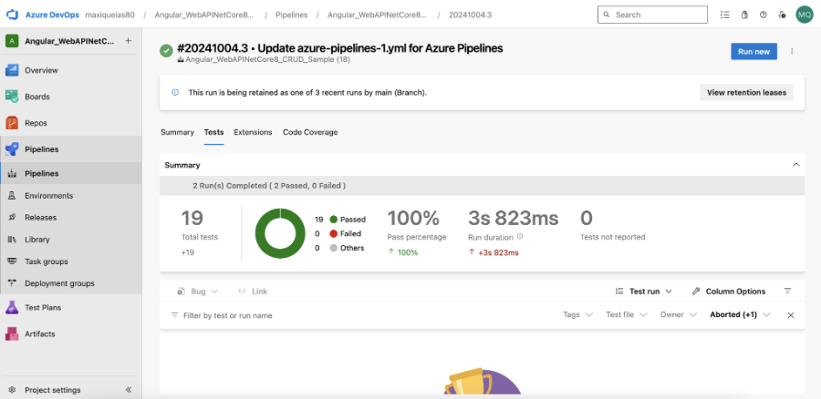
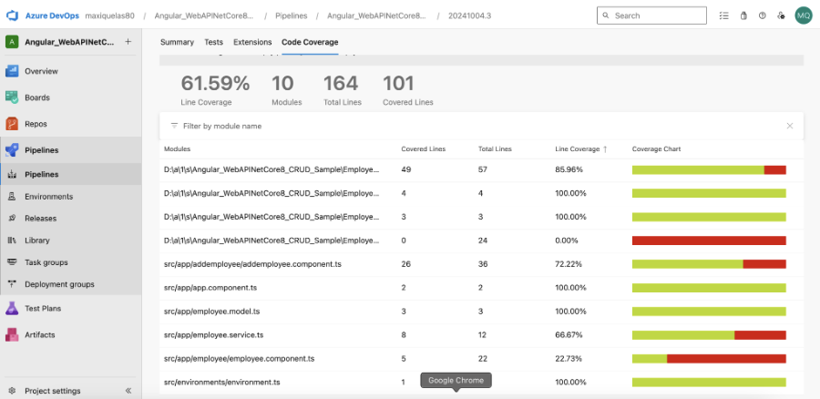

	4.2 Agregar Análisis Estático de Código con SonarCloud:
	Desarrollo del punto 4.2: Demostración de cómo integrar SonarCloud en un pipeline de CI/CD y cómo leer los reportes de análisis estático.
	4.2.1 Integraremos SonarCloud para analizar el código fuente. Configurar SonarCloud en nuestro pipeline siguiendo instructivo 5.1
	Antes de nuestra tarea de Build del Back:

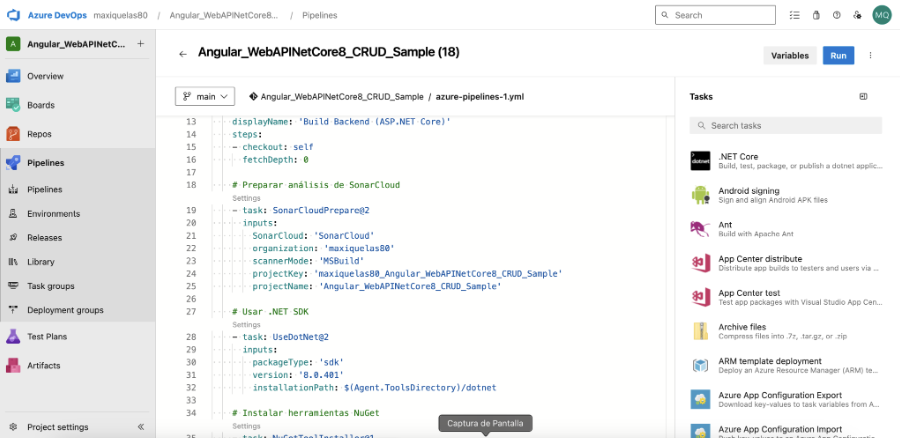
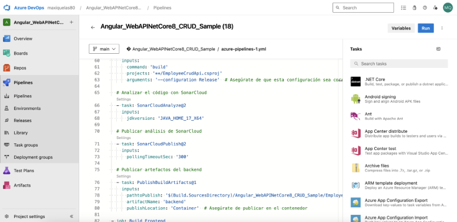

	4.2.2 Vemos el resultado de nuestro pipeline, en extensions tenemos un link al análisis realizado por SonarCloud

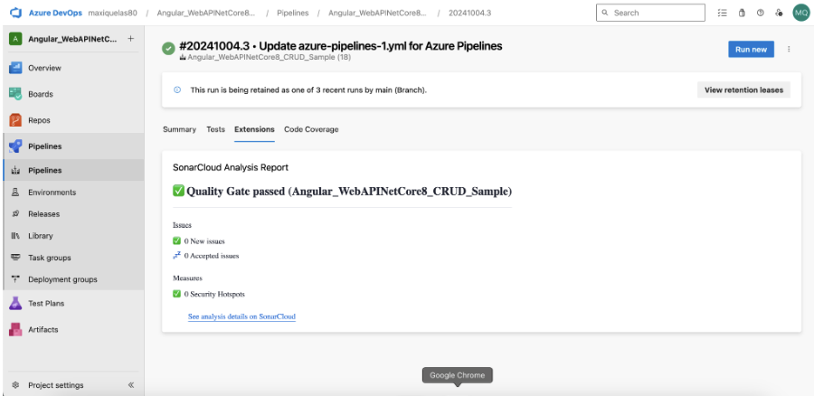

	4.2.3 Ir al link y analizar toda la información obtenida. Detallar en la entrega del TP los puntos más relevantes del informe, qué significan y para qué sirven.

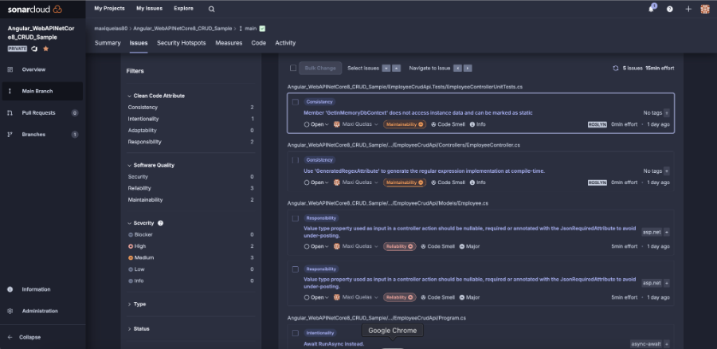

-1. **Atributos de Código Limpio**
	*Consistencia: Esta categoría enfatiza la necesidad de mantener prácticas de codificación uniformes en todo el proyecto. Los problemas como marcar métodos como estáticos cuando no acceden a datos de instancia ayudan a mejorar la claridad y mantenibilidad del código.
		Ejemplo:
		GetInMemoryDbContext no accede a datos de instancia y puede marcarse como estático.
		Esto sugiere mejorar la eficiencia del código al utilizar métodos estáticos donde sea apropiado.
		Responsabilidad: Se centra en garantizar que las clases y métodos tengan responsabilidades claras y que las entradas se validen adecuadamente.
		Ejemplo:
		La propiedad de tipo valor utilizada como entrada en una acción del controlador debería ser nullable, requerida o anotada con JsonRequiredAttribute para evitar el subenvío.
		Esto señala problemas potenciales con la forma en que se manejan los datos en las llamadas a la API, lo que puede llevar a errores en tiempo de ejecución o inconsistencias de datos.
		Intencionalidad: Esto sugiere que los desarrolladores deben ser deliberados en sus elecciones de codificación, lo que ayuda en la legibilidad y mantenibilidad del código.
		Ejemplo:
		Usar Await en lugar de RunAsync.
		Esto fomenta un manejo adecuado de asincronía, asegurando que la aplicación se mantenga receptiva.*

-2. **Calidad del Software**
	*Seguridad: Asegura que la base de código sea resistente a vulnerabilidades comunes, lo cual es crucial para proteger los datos de los usuarios y mantener la confianza.
		Fiabilidad: Se centra en garantizar que la aplicación se comporte como se espera bajo diversas condiciones, lo que es esencial para la satisfacción del usuario.
		Mantenibilidad: Resalta la facilidad con la que el código puede ser modificado o ampliado en el futuro. Esto puede incluir la reducción de la complejidad y asegurar que el código siga las mejores prácticas.*

-3. **Niveles de Severidad*
	*Los niveles de severidad (Bloqueador, Alto, Medio, Bajo, Info) ayudan a priorizar qué problemas abordar primero.
		Severidad Alta: Indica problemas críticos que podrían causar problemas significativos en la aplicación. Por ejemplo, no manejar adecuadamente los valores nulos puede llevar a bloqueos de la aplicación.
		Info: Estos son consejos o sugerencias generales que podrían mejorar la calidad del código pero que no son críticos.*

	4.3 Pruebas de Integración con Cypress:
	4.3.1 En el directorio raiz de nuestro proyecto Angular instalar el siguiente paquete:
	npm install cypress --save-dev

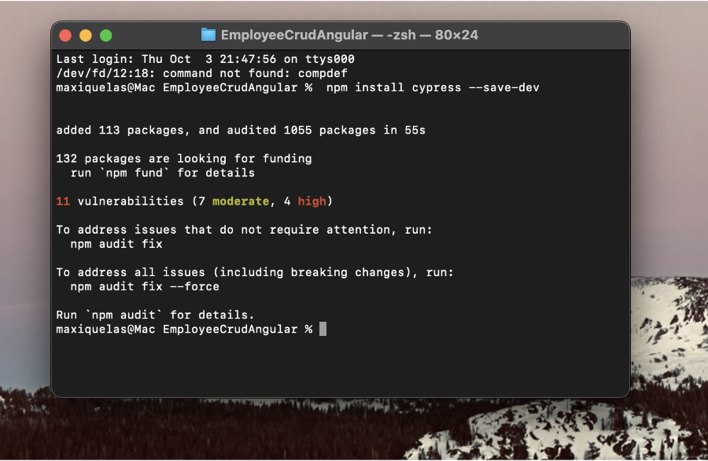

	4.3.2 Abrir Cypress:
	npx cypress open

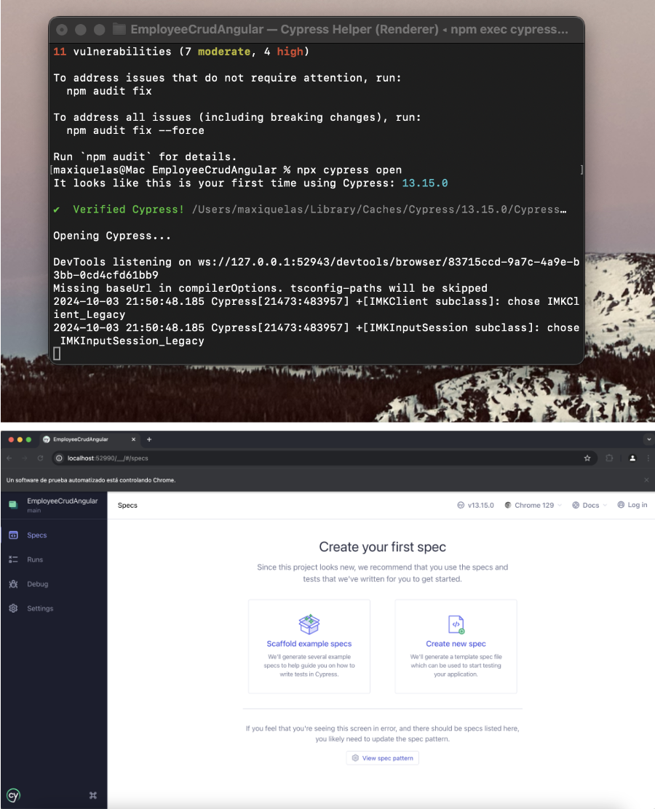

	4.3.3 Inicializar Cypress en nuestro proyecto como se indica en el instructivo 5.2
	Esto creará automáticamente una estructura de carpetas dentro de tu proyecto. 

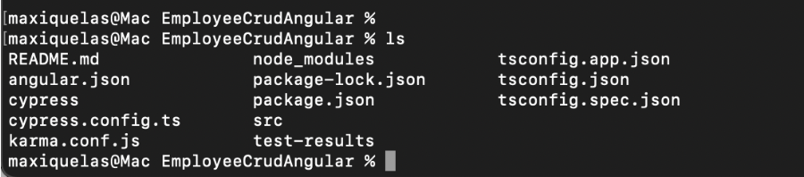

	cypress/e2e: Aquí es donde se almacenan tus archivos de prueba.

	cypress/fixtures: Aquí se almacenan los datos de prueba que puedes usar en tus tests.

	cypress/support: Contiene archivos de configuración y comandos personalizados.

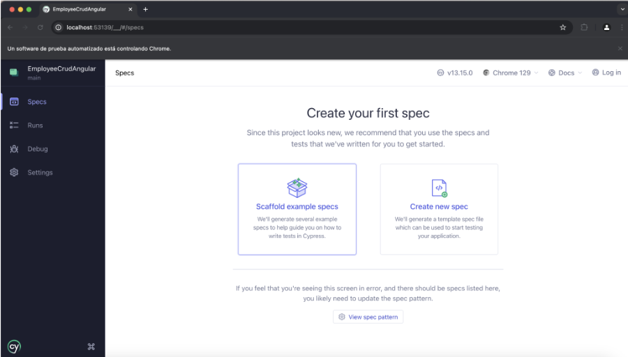
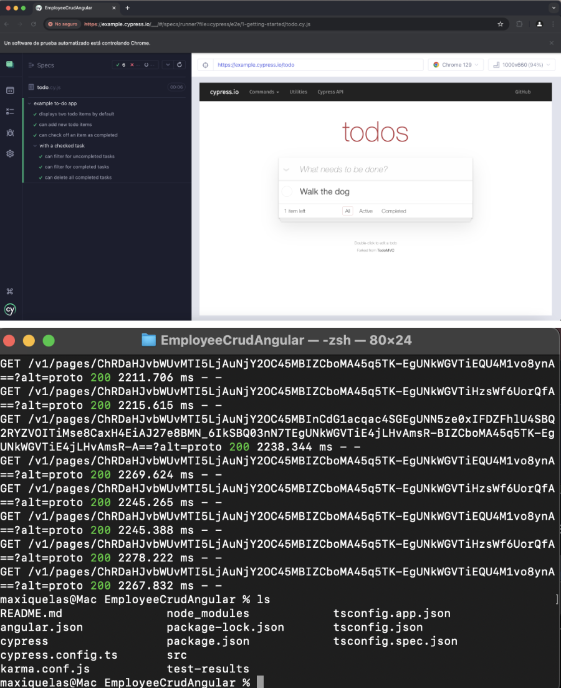

	4.3.4 Crear nuestra primera prueba navegando a nuestro front.
	En la carpeta cypress/e2e, crear un archivo con el nombre primer_test.js y agregar el siguiente código para probar la página de inicio de nuestro front:

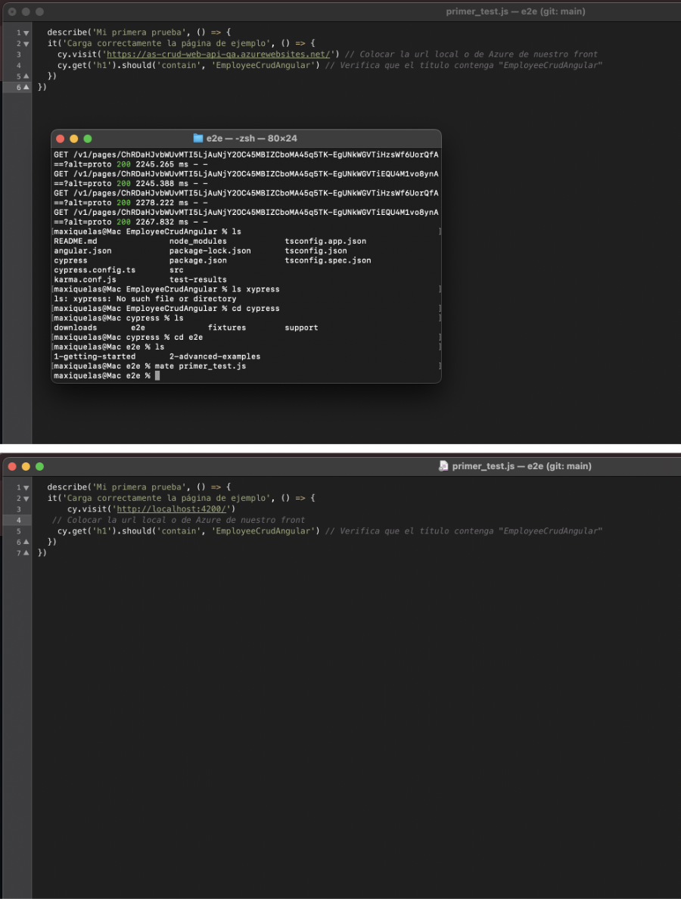

	4.3.5 Correr nuestra primera prueba
	Si está abierta la interfaz gráfica de Cypress, aparecerá el archivo primer_test.cy.js en la lista de pruebas. Clic en el archivo para ejecutar la prueba. image image

	También es posible ejecutar Cypress en modo "headless" (sin interfaz gráfica) utilizando el siguiente comando:
	npx cypress run

	4.3.6 Modificar nuestra prueba para que falle.
	Editamos el archivo primer_test.cy.js y hacemos que espere otra cosa en el título
	Ejecutamos cypress en modo headless.
	Cypress captura automáticamente pantallas cuando una prueba falla. Las capturas de pantalla se guardan en la carpeta cypress/screenshots. 

	4.3.6 Grabar nuestras pruebas para que Cypress genere código automático y genere reportes:
	Cerramos Cypress
	Editamos el archivo cypress.config.ts incluyendo la propiedad experimentalStudio en true y la configuración de reportería.

	Corremos nuevamente Cypress con npx cypress open, una vez que se ejecute nuestra prueba tendremos la opción de "Add Commands to Test". Esto permitirá interactuar con la aplicación y generar automáticamente comandos de prueba basados en las interacciones con la página:
	Por ejemplo, si agregamos un nuevo empleado y luego verificamos que esté en la lista, Cypress nos generará un código como este:

	Por supuesto que habrá que hacerle ajustes, como por ejemplo que se fije siempre en la última fila de la grilla y no en la posición 15 como lo grabó, es ahí cuando consultando la documentación de Cypress debemos ver cómo modificar el código, en nuestro caso de ejemplo sería así:

	4.3.7 Hacemos prueba de editar un empleado
	Creamos en cypress/e2e/ un archivo editEmployee_test.cy.js con el siguiente contenido, guardamos y aparecerá en Cypress:

