Quelas,Maximiliano
Ingeniería de software III

### TP9 :”Implementación de Contenedores en Azure Parte 2”

# 4- Desarrollo:

	4.1 Modificar nuestro pipeline para incluir el deploy en QA y PROD de Imagenes Docker en Servicio Azure App Services con Soporte para Contenedores
	4.1.1 - Agregar a nuestro pipeline una nueva etapa que dependa de nuestra etapa de Construcción y Pruebas y de la etapa de Construcción de Imagenes Docker y subida a ACR realizada en el TP08
	Agregar tareas para crear un recurso Azure Container Instances que levante un contenedor con nuestra imagen de back utilizando un AppServicePlan en Linux

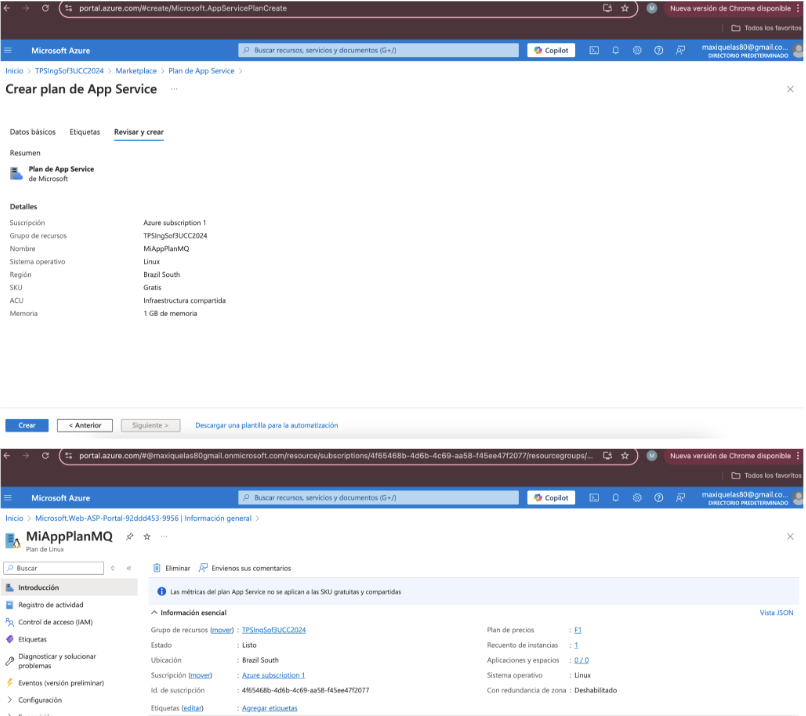
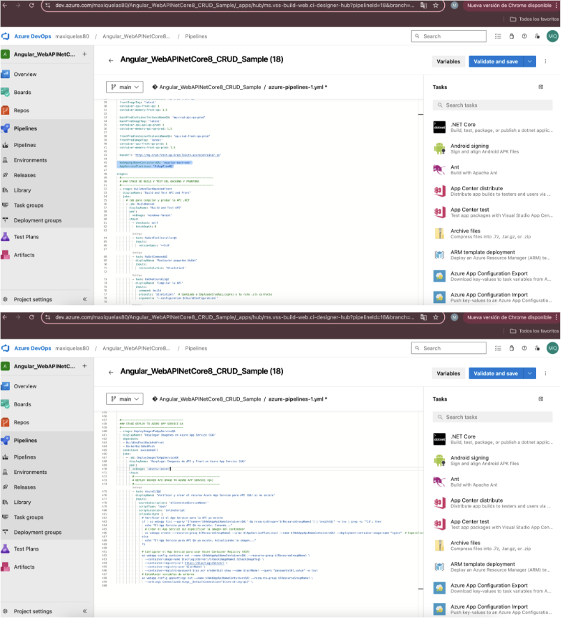
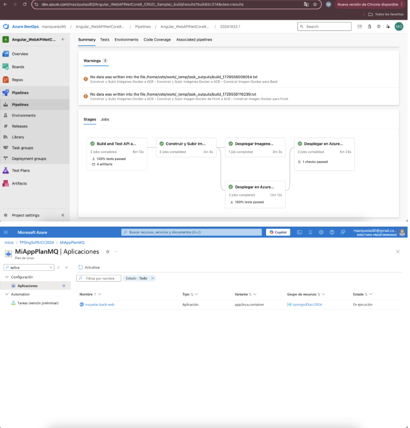
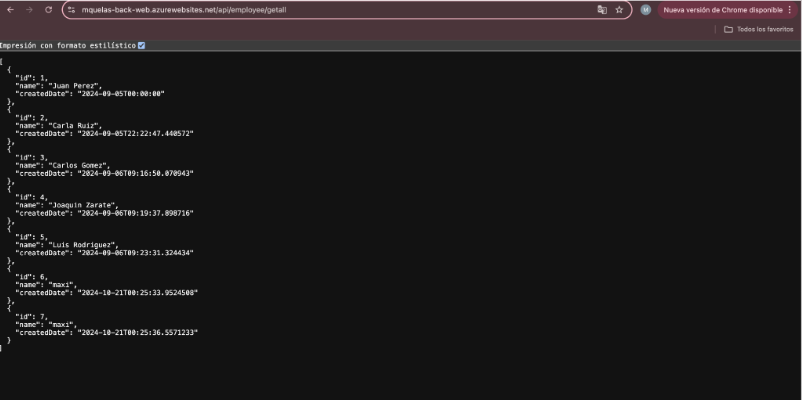

	4.2 Desafíos:
	4.2.1 Agregar tareas para generar Front en Azure App Service con Soporte para Contenedores

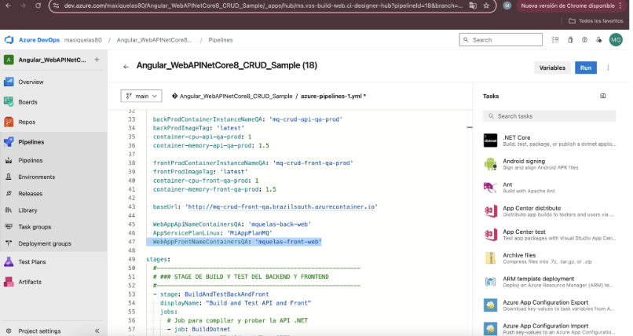
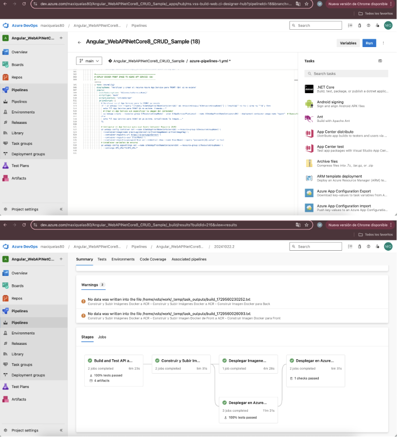
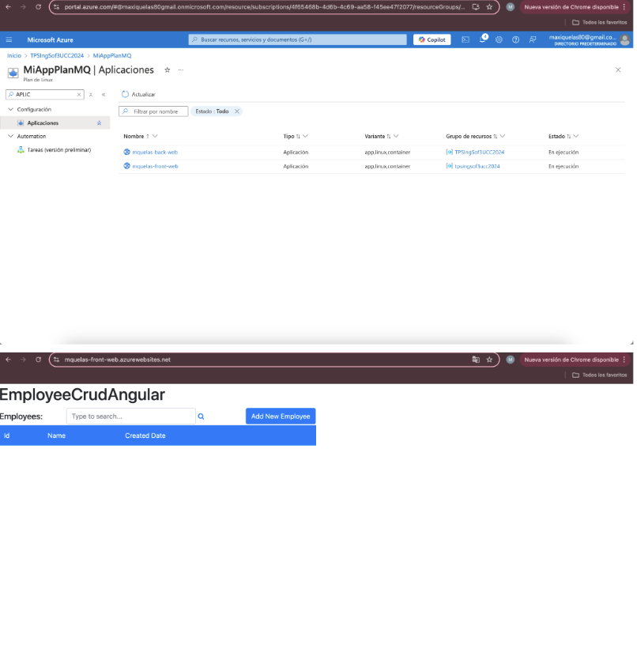

	4.2.2 Agregar variables necesarias para el funcionamiento de la nueva etapa considerando que debe haber 2 entornos QA y PROD para Back y Front.

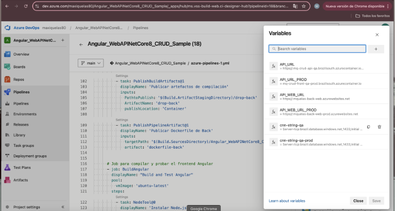

	4.2.3 Agregar tareas para correr pruebas de integración en el entorno de QA de Back y Front creado en Azure App Services con Soporte para Contenedores.

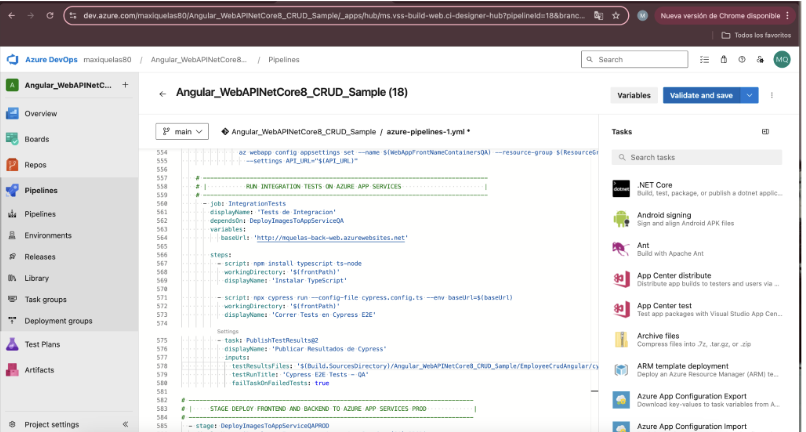

	4.2.4 Agregar etapa que dependa de la etapa de Deploy en QA que genere un entorno de PROD.

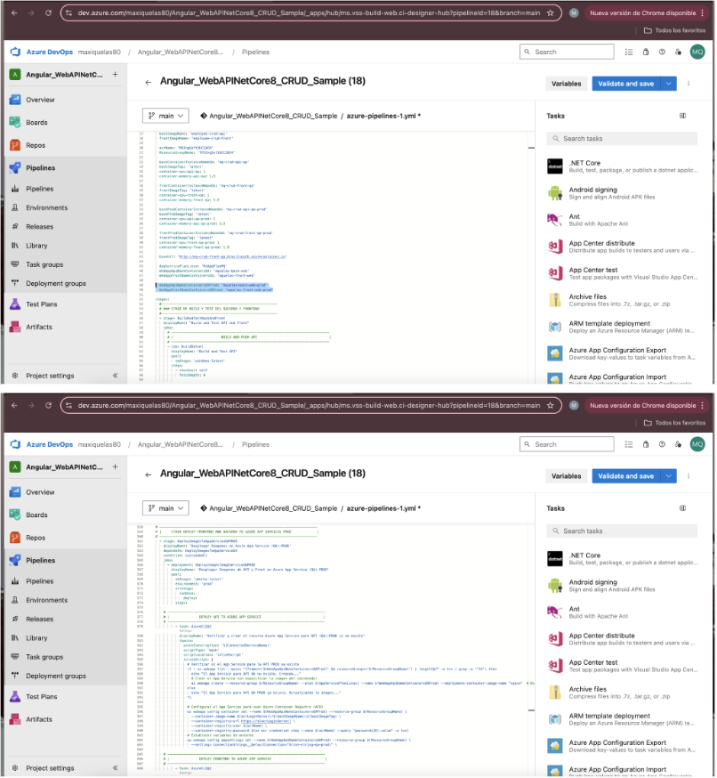
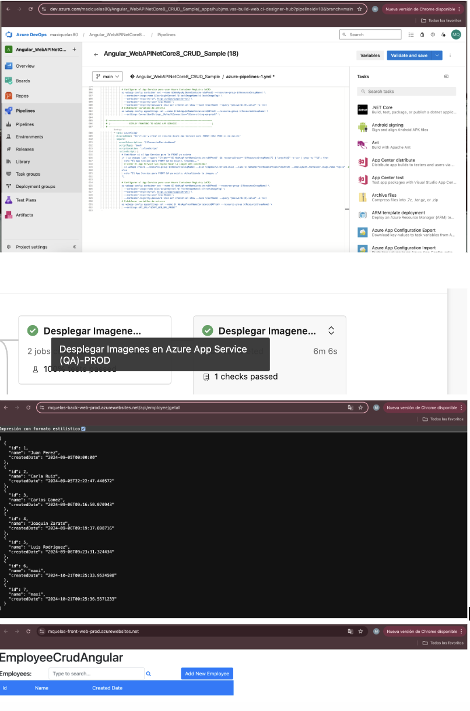

	4.2.5 Entregar un pipeline que incluya:
	A) Etapa Construcción y Pruebas Unitarias y Code Coverage Back y Front
	B) Construcción de Imágenes Docker y subida a ACR
	C) Deploy Back y Front en QA con pruebas de integración para Azure Web Apps
	D) Deploy Back y Front en QA con pruebas de integración para ACI
	E) Deploy Back y Front en QA con pruebas de integración para Azure Web Apps con Soporte para contenedores
	F) Aprobación manual de QA para los puntos C,D,E
	G) Deploy Back y Front en PROD para Azure Web Apps
	H) Deploy Back y Front en PROD para ACI
	I) Deploy Back y Front en PROD para Azure Web Apps con Soporte para contenedores

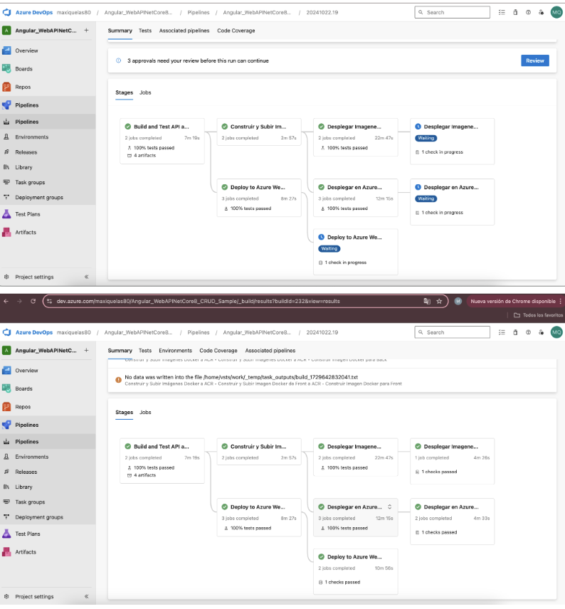
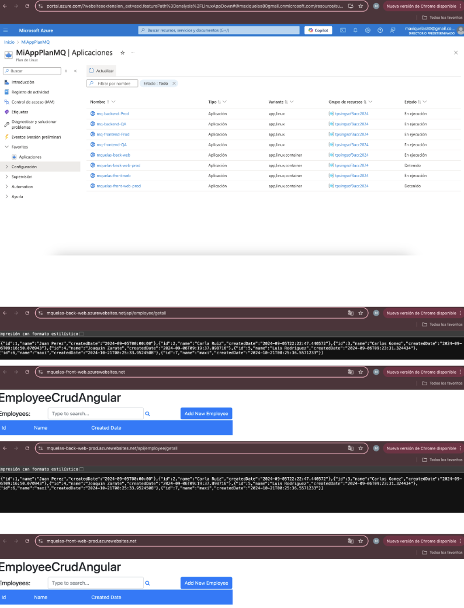
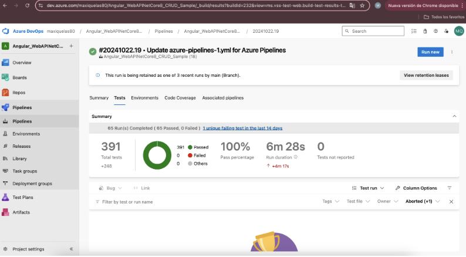

trigger:
  - main

pool:
  vmImage: 'windows-latest'

variables:
  # Cambia esta variable para que apunte a tu archivo .sln o .csproj
  solution: '**/EmployeeCrudApi.csproj'  # O usa *.sln si tienes una solución
  buildPlatform: 'Any CPU'
  buildConfiguration: 'Release'
  frontPath: 'Angular_WebAPINetCore8_CRUD_Sample/EmployeeCrudAngular'

  # AZURE VARIABLES
  ConnectedServiceName: 'ServiceConnectionARM'
  acrLoginServer: 'mqingsoft3uccacr.azurecr.io'
  backImageName: 'employee-crud-api'
  frontImageName: 'employee-crud-front'
  
  acrName: 'MQIngSoft3UCCACR'
  ResourceGroupName: 'TPSIngSof3UCC2024'
  
  backContainerInstanceNameQA: 'mq-crud-api-qa'
  backImageTag: 'latest'
  container-cpu-api-qa: 1Ω
  container-memory-api-qa: 1.5
    
  frontContainerInstanceNameQA: 'mq-crud-front-qa'
  frontImageTag: 'latest'
  container-cpu-front-qa: 1
  container-memory-front-qa: 1.5

  backProdContainerInstanceNameQA: 'mq-crud-api-qa-prod'
  backProdImageTag: 'latest'
  container-cpu-api-qa-prod: 1
  container-memory-api-qa-prod: 1.5

  frontProdContainerInstanceNameQA: 'mq-crud-front-qa-prod'
  frontProdImageTag: 'latest'
  container-cpu-front-qa-prod: 1
  container-memory-front-qa-prod: 1.5

  baseUrl: 'http://mq-crud-front-qa.brazilsouth.azurecontainer.io'
  
  AppServicePlanLinux: 'MiAppPlanMQ'
  WebAppApiNameContainersQA: 'mquelas-back-web'
  WebAppFrontNameContainersQA: 'mquelas-front-web'

  WebAppApiNameContainersQAProd: 'mquelas-back-web-prod'
  WebAppFrontNameContainersQAProd: 'mquelas-front-web-prod'

# WEB APPS
  WebAppApiNameQA: 'mq-backend-QA'
  api_url_wa_qa: 'https://$(WebAppApiNameQA).azurewebsites.net/api/Employee'

  WebAppFrontNameQA: 'mq-frontend-QA'
  front_url_wa_qa: 'https://$(WebAppFrontNameQA).azurewebsites.net'

  WebAppApiNameProd: 'mq-backend-Prod'
  api_url_wa_prod: 'https://$(WebAppApiNameProd).azurewebsites.net/api/Employee'

  WebAppFrontNameProd: 'mq-frontend-Prod'
  front_url_wa_prod: 'https://$(WebAppFrontNameProd).azurewebsites.net'

stages:
  #----------------------------------------------------------
  # ### STAGE DE BUILD Y TEST DEL BACKEND Y FRONTEND
  #----------------------------------------------------------
  - stage: BuildAndTestBackAndFront
    displayName: "Build and Test API and Front"
    jobs:
      # -------------------------------------------------------------------------------
      # |                        BUILD AND PUSH API                                    |
      # -------------------------------------------------------------------------------
      - job: BuildDotnet
        displayName: "Build and Test API"
        pool:
          vmImage: 'windows-latest'
        steps:
          - checkout: self
            fetchDepth: 0

          - task: NuGetToolInstaller@1
            inputs:
              versionSpec: '>=5.8'

          - task: NuGetCommand@2
            displayName: 'Restaurar paquetes NuGet'
            inputs:
              restoreSolution: '$(solution)'

          - task: DotNetCoreCLI@2
            displayName: 'Compilar la API'
            inputs:
              command: build
              projects: '$(solution)'  # Cambiado a EmployeeCrudApi.csproj o la ruta .sln correcta
              arguments: '--configuration $(buildConfiguration)'

          - task: DotNetCoreCLI@2
            displayName: 'Ejecutar pruebas de la API'
            inputs:
              command: test
              projects: '**/*.Tests.csproj'
              arguments: '--collect:"XPlat Code Coverage"'

          - task: PublishCodeCoverageResults@2
            displayName: 'Publicar resultados de code coverage del back-end'
            inputs:
              summaryFileLocation: '$(Agent.TempDirectory)/**/*.cobertura.xml'
              failIfCoverageEmpty: false

          - task: DotNetCoreCLI@2
            displayName: 'Publicar aplicación'
            inputs:
              command: publish
              publishWebProjects: True
              arguments: '--configuration $(buildConfiguration) --no-restore --output $(Build.ArtifactStagingDirectory)/drop-back'
              zipAfterPublish: false

          - task: PublishBuildArtifacts@1
            displayName: 'Publicar artefactos de compilación'
            inputs:
              PathtoPublish: '$(Build.ArtifactStagingDirectory)/drop-back'
              ArtifactName: 'drop-back'
              publishLocation: 'Container'

          - task: PublishPipelineArtifact@1
            displayName: 'Publicar Dockerfile de Back'
            inputs:
              targetPath: '$(Build.SourcesDirectory)/Angular_WebAPINetCore8_CRUD_Sample/docker/api/dockerfile'  # Cambiado a 'Dockerfile'
              artifact: 'dockerfile-back'

      # -------------------------------------------------------------------------------
      # |                        BUILD AND PUSH FRONT                                 |
      # -------------------------------------------------------------------------------
      - job: BuildAngular
        displayName: "Build and Test Angular"
        pool:
          vmImage: 'ubuntu-latest'
        steps:
          - task: NodeTool@0
            displayName: 'Instalar Node.js'
            inputs:
              versionSpec: '22.x'

          - script: npm install
            displayName: 'Instalar dependencias'
            workingDirectory: $(frontPath)

          - script: npx ng test --karma-config=karma.conf.js --watch=false --browsers ChromeHeadless --code-coverage
            displayName: 'Ejecutar pruebas del front'
            workingDirectory: $(frontPath)
            continueOnError: true

          - task: PublishCodeCoverageResults@2
            displayName: 'Publicar resultados de code coverage del front'
            inputs:
              summaryFileLocation: '$(frontPath)/coverage/lcov.info'
              failIfCoverageEmpty: false
            condition: always()

          - task: PublishTestResults@2
            displayName: 'Publicar resultados de pruebas unitarias del front'
            inputs:
              testResultsFormat: 'JUnit'
              testResultsFiles: '$(frontPath)/test-results/test-results.xml'
              failTaskOnFailedTests: true
            condition: always()

          - script: npm run build
            displayName: 'Compilar el proyecto Angular'
            workingDirectory: $(frontPath)

          - task: PublishBuildArtifacts@1
            displayName: 'Publicar artefactos Angular'
            inputs:
              PathtoPublish: '$(frontPath)/dist'
              ArtifactName: 'drop-front'

          - task: PublishPipelineArtifact@1
            displayName: 'Publicar Dockerfile de Front'
            inputs:
              targetPath: '$(Build.SourcesDirectory)/Angular_WebAPINetCore8_CRUD_Sample/docker/front/dockerfile'  # Cambiado a 'Dockerfile'
              artifact: 'dockerfile-front'

# -------------------------------------------------------------------------------
# |     STAGE BUILD AND PUSH FRONTEND AND BACKEND DOCKER IMAGES TO ACR          |
# -------------------------------------------------------------------------------
  - stage: DockerBuildAndPush
    displayName: 'Construir y Subir Imágenes Docker a ACR'
    dependsOn: BuildAndTestBackAndFront
    jobs:
    # -------------------------------------------------------------------------------
    # |                        BUILD AND PUSH API                                    |
    # -------------------------------------------------------------------------------
      - job: docker_build_and_push
        displayName: 'Construir y Subir Imágenes Docker a ACR'
        pool:
          vmImage: 'ubuntu-latest'
          
        steps:
          - checkout: self

          - task: DownloadPipelineArtifact@2
            displayName: 'Descargar Artefactos de Back'
            inputs:
              buildType: 'current'
              artifactName: 'drop-back'
              targetPath: '$(Pipeline.Workspace)/drop-back'
          
          - task: DownloadPipelineArtifact@2
            displayName: 'Descargar Dockerfile de Back'
            inputs:
              buildType: 'current'
              artifactName: 'dockerfile-back'
              targetPath: '$(Pipeline.Workspace)/dockerfile-back'

          - task: AzureCLI@2
            displayName: 'Iniciar Sesión en Azure Container Registry (ACR)'
            inputs:
              azureSubscription: '$(ConnectedServiceName)'
              scriptType: bash
              scriptLocation: inlineScript
              inlineScript: |
                # Obtener las credenciales del ACR
                acr_username=$(az acr credential show --name $(acrName) --query "username" -o tsv)
                acr_password=$(az acr credential show --name $(acrName) --query "passwords[0].value" -o tsv)

                # Iniciar sesión en ACR
                az acr login --name $(acrName) --username $acr_username --password $acr_password
      
          - task: Docker@2
            displayName: 'Construir Imagen Docker para Back'
            inputs:
              command: build
              repository: $(acrLoginServer)/$(backImageName)
              dockerfile: $(Pipeline.Workspace)/dockerfile-back/dockerfile  # Cambiado a 'Dockerfile'
              buildContext: $(Pipeline.Workspace)/drop-back
              tags: 'latest'

          - task: Docker@2
            displayName: 'Subir Imagen Docker de Back a ACR'
            inputs:
              command: push
              repository: $(acrLoginServer)/$(backImageName)
              tags: 'latest'
    # -------------------------------------------------------------------------------
    # |                        BUILD AND PUSH FRONT                                 |
    # -------------------------------------------------------------------------------
      - job: docker_build_and_push_front
        displayName: 'Construir y Subir Imagen Docker de Front a ACR'
        pool:
          vmImage: 'ubuntu-latest'
          
        steps:
          - checkout: self

          - task: DownloadPipelineArtifact@2
            displayName: 'Descargar Artefactos de Front'
            inputs:
              buildType: 'current'
              artifactName: 'drop-front'
              targetPath: '$(Pipeline.Workspace)/drop-front'
          
          - task: DownloadPipelineArtifact@2
            displayName: 'Descargar Dockerfile de Front'
            inputs:
              buildType: 'current'
              artifactName: 'dockerfile-front'
              targetPath: '$(Pipeline.Workspace)/dockerfile-front'

          - task: AzureCLI@2
            displayName: 'Iniciar Sesión en Azure Container Registry (ACR)'
            inputs:
              azureSubscription: '$(ConnectedServiceName)'
              scriptType: bash
              scriptLocation: inlineScript
              inlineScript: |
                # Obtener las credenciales del ACR
                acr_username=$(az acr credential show --name $(acrName) --query "username" -o tsv)
                acr_password=$(az acr credential show --name $(acrName) --query "passwords[0].value" -o tsv)

                # Iniciar sesión en ACR
                az acr login --name $(acrName) --username $acr_username --password $acr_password

          - task: Docker@2
            displayName: 'Construir Imagen Docker para Front'
            inputs:
              command: build
              repository: $(acrLoginServer)/$(frontImageName)
              dockerfile: $(Pipeline.Workspace)/dockerfile-front/dockerfile  # Cambiado a 'Dockerfile'
              buildContext: $(Pipeline.Workspace)/drop-front
              tags: 'latest'

          - task: Docker@2
            displayName: 'Subir Imagen Docker de Front a ACR'
            inputs:
              command: push
              repository: $(acrLoginServer)/$(frontImageName)
              tags: 'latest'

# -------------------------------------------------------------------------------
# |      STAGE DEPLOY FRONTEND AND BACKEND TO AZURE CONTAINER INSTANCES QA      |
# -------------------------------------------------------------------------------
  - stage: DeployToACIQA
    displayName: 'Desplegar en Azure Container Instances (ACI) QA'
    dependsOn: DockerBuildAndPush 
    jobs:
    # -------------------------------------------------------------------------------
    # |               DEPLOY API TO AZURE CONTAINER INSTANCES                       |
    # -------------------------------------------------------------------------------
      - job: deploy_to_aci_qa
        displayName: 'Desplegar en Azure Container Instances (ACI) QA'
        pool:
          vmImage: 'ubuntu-latest'
        steps:
      

        - task: AzureCLI@2
          displayName: 'Desplegar Imagen Docker de Back en ACI QA'
          inputs:
            azureSubscription: '$(ConnectedServiceName)'
            scriptType: bash
            scriptLocation: inlineScript
            inlineScript: |
              echo "Resource Group: $(ResourceGroupName)"
              echo "Container Instance Name: $(backContainerInstanceNameQA)"
              echo "ACR Login Server: $(acrLoginServer)"
              echo "Image Name: $(backImageName)"
              echo "Image Tag: $(backImageTag)"
              echo "Connection String: $(cnn-string-qa)"
          
              az container delete --resource-group $(ResourceGroupName) --name $(backContainerInstanceNameQA) --yes

              az container create --resource-group $(ResourceGroupName) \
                --name $(backContainerInstanceNameQA) \
                --image $(acrLoginServer)/$(backImageName):$(backImageTag) \
                --registry-login-server $(acrLoginServer) \
                --registry-username $(acrName) \
                --registry-password $(az acr credential show --name $(acrName) --query "passwords[0].value" -o tsv) \
                --dns-name-label $(backContainerInstanceNameQA) \
                --ports 80 \
                --environment-variables ConnectionStrings__DefaultConnection="$(cnn-string-qa)" \
                --restart-policy Always \
                --cpu $(container-cpu-api-qa) \
                --memory $(container-memory-api-qa)
    # -------------------------------------------------------------------------------
    # |               DEPLOY FRONT TO AZURE CONTAINER INSTANCES                      |
    # -------------------------------------------------------------------------------
      - job: deploy_front_to_aci_qa
        displayName: 'Desplegar Frontend en Azure Container Instances (ACI) QA'
        pool:
          vmImage: 'ubuntu-latest'
        steps:
  
        - task: AzureCLI@2
          displayName: 'Desplegar Imagen Docker de Front en ACI QA'
          inputs:
            azureSubscription: '$(ConnectedServiceName)'
            scriptType: bash
            scriptLocation: inlineScript
            inlineScript: |
              echo "Resource Group: $(ResourceGroupName)"
              echo "Container Instance Name: $(frontContainerInstanceNameQA)"
              echo "ACR Login Server: $(acrLoginServer)"
              echo "Image Name: $(frontImageName)"
              echo "Image Tag: $(frontImageTag)"

              az container delete --resource-group $(ResourceGroupName) --name $(frontContainerInstanceNameQA) --yes

              az container create --resource-group $(ResourceGroupName) \
              --name $(frontContainerInstanceNameQA) \
              --image $(acrLoginServer)/$(frontImageName):$(frontImageTag) \
              --registry-login-server $(acrLoginServer) \
              --registry-username $(acrName) \
              --registry-password $(az acr credential show --name $(acrName) --query "passwords[0].value" -o tsv) \
              --dns-name-label $(frontContainerInstanceNameQA) \
              --ports 80 \
              --environment-variables API_URL="$(API_URL)" \
              --restart-policy Always \
              --cpu $(container-cpu-front-qa) \
              --memory $(container-memory-front-qa)

              # job para los Test de Integración
    # -------------------------------------------------------------------------------
    # |           RUN INTEGRATION TESTS ON AZURE CONTAINER INSTANCES                |
    # -------------------------------------------------------------------------------
      - job: RunCypressTests
        displayName: 'Run Cypress Tests'
        dependsOn: [deploy_front_to_aci_qa, deploy_to_aci_qa]
        condition: succeeded()
                
        steps:
                - script: npm install typescript ts-node
                  workingDirectory: '$(frontPath)'
                  displayName: 'Instalar TypeScript'
                
                - script: npx cypress run --config-file cypress.config.ts --env baseUrl=$(baseUrl)
                  workingDirectory: '$(frontPath)'
                  displayName: 'Correr Tests en Cypress E2E'

                - task: PublishTestResults@2
                  displayName: 'Publicar Resultados de Cypress'
                  inputs:
                    testResultsFiles: '$(Build.SourcesDirectory)/Angular_WebAPINetCore8_CRUD_Sample/EmployeeCrudAngular/cypress/results/*.xml'
                    testRunTitle: 'Cypress E2E Tests - QA'
                    failTaskOnFailedTests: true

# -------------------------------------------------------------------------------
# |    STAGE DEPLOY FRONTEND AND BACKEND TO AZURE CONTAINER INSTANCES PROD       |
# -------------------------------------------------------------------------------
  - stage: DeployToACIQAPROD
    displayName: 'Desplegar en Azure Container Instances (ACI) QA-Prod'
    dependsOn: DeployToACIQA 
    jobs:
    # -------------------------------------------------------------------------------
    # |               DEPLOY API TO AZURE CONTAINER INSTANCES                       |
    # -------------------------------------------------------------------------------
      - deployment:  deploy_to_aci_qa_prod
        displayName: 'Desplegar en Azure Container Instances (ACI) QA-Prod'
        environment: 'Prod'  # Colocar 'environment' aquí
        strategy: 
          runOnce:
            deploy:
              steps:
      

              - task: AzureCLI@2
                displayName: 'Desplegar Imagen Docker de Back en ACI QA-Prod'
                inputs:
                  azureSubscription: '$(ConnectedServiceName)'
                  scriptType: bash
                  scriptLocation: inlineScript
                  inlineScript: |
                    echo "Resource Group: $(ResourceGroupName)"
                    echo "Container Instance Name: $(backProdContainerInstanceNameQA)"
                    echo "ACR Login Server: $(acrLoginServer)"
                    echo "Image Name: $(backImageName)"
                    echo "Image Tag: $(backProdImageTag)"
                    echo "Connection String: $(cnn-string-qa-prod)"
                
                    az container delete --resource-group $(ResourceGroupName) --name $(backProdContainerInstanceNameQA) --yes

                    az container create --resource-group $(ResourceGroupName) \
                      --name $(backProdContainerInstanceNameQA) \
                      --image $(acrLoginServer)/$(backImageName):$(backProdImageTag) \
                      --registry-login-server $(acrLoginServer) \
                      --registry-username $(acrName) \
                      --registry-password $(az acr credential show --name $(acrName) --query "passwords[0].value" -o tsv) \
                      --dns-name-label $(backProdContainerInstanceNameQA) \
                      --ports 80 \
                      --environment-variables ConnectionStrings__DefaultConnection="$(cnn-string-qa-prod)" \
                      --restart-policy Always \
                      --cpu $(container-cpu-api-qa-prod) \
                      --memory $(container-memory-api-qa-prod)
    # -------------------------------------------------------------------------------
    # |               DEPLOY FRONT TO AZURE CONTAINER INSTANCES                      |
    # -------------------------------------------------------------------------------
      - deployment: deploy_front_to_aci_qa_prod
        displayName: 'Desplegar Frontend en Azure Container Instances (ACI) QA-Prod'
        environment: 'Prod'  # Colocar 'environment' aquí
        strategy: 
          runOnce:
            deploy:
              steps:
  
              - task: AzureCLI@2
                displayName: 'Desplegar Imagen Docker de Front en ACI QA-Prod'
                inputs:
                  azureSubscription: '$(ConnectedServiceName)'
                  scriptType: bash
                  scriptLocation: inlineScript
                  inlineScript: |
                    echo "Resource Group: $(ResourceGroupName)"
                    echo "Container Instance Name: $(frontProdContainerInstanceNameQA)"
                    echo "ACR Login Server: $(acrLoginServer)"
                    echo "Image Name: $(frontImageName)"
                    echo "Image Tag: $(frontProdImageTag)"

                    az container delete --resource-group $(ResourceGroupName) --name $(frontProdContainerInstanceNameQA) --yes

                    az container create --resource-group $(ResourceGroupName) \
                    --name $(frontProdContainerInstanceNameQA) \
                    --image $(acrLoginServer)/$(frontImageName):$(frontProdImageTag) \
                    --registry-login-server $(acrLoginServer) \
                    --registry-username $(acrName) \
                    --registry-password $(az acr credential show --name $(acrName) --query "passwords[0].value" -o tsv) \
                    --dns-name-label $(frontProdContainerInstanceNameQA) \
                    --ports 80 \
                    --environment-variables API_URL="$(API_URL_PROD)" \
                    --restart-policy Always \
                    --cpu $(container-cpu-front-qa-prod) \
                    --memory $(container-memory-front-qa-prod)

# -------------------------------------------------------------------------------
# |     STAGE DEPLOY FRONTEND AND BACKEND TO AZURE APP SERVICES QA              |
# -------------------------------------------------------------------------------
  - stage: DeployImagesToAppServiceQA
    displayName: 'Desplegar Imagenes en Azure App Service (QA)'
    dependsOn: 
    - BuildAndTestBackAndFront
    - DockerBuildAndPush
    condition: succeeded()
    jobs:
      - job: DeployImagesToAppServiceQA
        displayName: 'Desplegar Imagenes de API y Front en Azure App Service (QA)'
        pool:
          vmImage: 'ubuntu-latest'
        steps:
    # -------------------------------------------------------------------------------
    # |               DEPLOY API TO AZURE APP SERVICE                               |
    # -------------------------------------------------------------------------------
          - task: AzureCLI@2
            displayName: 'Verificar y crear el recurso Azure App Service para API (QA) si no existe'
            inputs:
              azureSubscription: '$(ConnectedServiceName)'
              scriptType: 'bash'
              scriptLocation: 'inlineScript'
              inlineScript: |
                # Verificar si el App Service para la API ya existe
                if ! az webapp list --query "[?name=='$(WebAppApiNameContainersQA)' && resourceGroup=='$(ResourceGroupName)'] | length(@)" -o tsv | grep -q '^1$'; then
                  echo "El App Service para API QA no existe. Creando..."
                  # Crear el App Service sin especificar la imagen del contenedor
                  az webapp create --resource-group $(ResourceGroupName) --plan $(AppServicePlanLinux) --name $(WebAppApiNameContainersQA) --deployment-container-image-name "nginx"  # Especifica una imagen temporal para permitir la creación
                else
                  echo "El App Service para API QA ya existe. Actualizando la imagen..."
                fi
  
                # Configurar el App Service para usar Azure Container Registry (ACR)
                az webapp config container set --name $(WebAppApiNameContainersQA) --resource-group $(ResourceGroupName) \
                  --container-image-name $(acrLoginServer)/$(backImageName):$(backImageTag) \
                  --container-registry-url https://$(acrLoginServer) \
                  --container-registry-user $(acrName) \
                  --container-registry-password $(az acr credential show --name $(acrName) --query "passwords[0].value" -o tsv)
                # Establecer variables de entorno
                az webapp config appsettings set --name $(WebAppApiNameContainersQA) --resource-group $(ResourceGroupName) \
                  --settings ConnectionStrings__DefaultConnection="$(cnn-string-qa)" \
    
    # -------------------------------------------------------------------------------
    # |               DEPLOY FRONTEND TO AZURE APP SERVICE                           |
    # -------------------------------------------------------------------------------
          - task: AzureCLI@2
            displayName: 'Verificar y crear el recurso Azure App Service para FRONT (QA) si no existe'
            inputs:
              azureSubscription: '$(ConnectedServiceName)'
              scriptType: 'bash'
              scriptLocation: 'inlineScript'
              inlineScript: |
                # Verificar si el App Service para la FRONT ya existe
                if ! az webapp list --query "[?name=='$(WebAppFrontNameContainersQA)' && resourceGroup=='$(ResourceGroupName)'] | length(@)" -o tsv | grep -q '^1$'; then
                  echo "El App Service para FRONT QA no existe. Creando..."
                  # Crear el App Service sin especificar la imagen del contenedor
                  az webapp create --resource-group $(ResourceGroupName) --plan $(AppServicePlanLinux) --name $(WebAppFrontNameContainersQA) --deployment-container-image-name "nginx"  # Especifica una imagen temporal para permitir la creación
                else
                  echo "El App Service para FRONT QA ya existe. Actualizando la imagen..."
                fi
  
                # Configurar el App Service para usar Azure Container Registry (ACR)
                az webapp config container set --name $(WebAppFrontNameContainersQA) --resource-group $(ResourceGroupName) \
                  --container-image-name $(acrLoginServer)/$(frontImageName):$(frontImageTag) \
                  --container-registry-url https://$(acrLoginServer) \
                  --container-registry-user $(acrName) \
                  --container-registry-password $(az acr credential show --name $(acrName) --query "passwords[0].value" -o tsv)
                # Establecer variables de entorno
                az webapp config appsettings set --name $(WebAppFrontNameContainersQA) --resource-group $(ResourceGroupName) \
                  --settings API_URL="$(API_URL)"

    # -------------------------------------------------------------------------------
    # |           RUN INTEGRATION TESTS ON AZURE APP SERVICES                       |
    # -------------------------------------------------------------------------------
      - job: RunCypressTests
        displayName: 'Run Cypress Tests'
        dependsOn: DeployImagesToAppServiceQA
        variables:
          baseUrl: 'http://mquelas-front-web.azurewebsites.net'        
        steps:
                - script: npm install typescript ts-node
                  workingDirectory: '$(frontPath)'
                  displayName: 'Instalar TypeScript'
                
                - script: npx cypress run --config-file cypress.config.ts --env baseUrl=$(baseUrl)
                  workingDirectory: '$(frontPath)'
                  displayName: 'Correr Tests en Cypress E2E'

                - task: PublishTestResults@2
                  displayName: 'Publicar Resultados de Cypress'
                  inputs:
                    testResultsFiles: '$(Build.SourcesDirectory)/Angular_WebAPINetCore8_CRUD_Sample/EmployeeCrudAngular/cypress/results/*.xml'
                    testRunTitle: 'Cypress E2E Tests - QA'
                    failTaskOnFailedTests: true

# -------------------------------------------------------------------------------
# |     STAGE DEPLOY FRONTEND AND BACKEND TO AZURE APP SERVICES PROD             |
# -------------------------------------------------------------------------------
  - stage: DeployImagesToAppServiceQAPROD
    displayName: 'Desplegar Imagenes en Azure App Service (QA)-PROD'
    dependsOn: DeployImagesToAppServiceQA
    condition: succeeded()
    jobs:
      - deployment: DeployImagesToAppServiceQAPROD
        displayName: 'Desplegar Imagenes de API y Front en Azure App Service (QA)-PROD'
        environment: 'Prod'  # Colocar 'environment' aquí
        strategy: 
          runOnce:
            deploy:
              steps:
      
    # -------------------------------------------------------------------------------
    # |               DEPLOY API TO AZURE APP SERVICE                               |
    # -------------------------------------------------------------------------------
              - task: AzureCLI@2
                displayName: 'Verificar y crear el recurso Azure App Service para API (QA)-PROD si no existe'
                inputs:
                  azureSubscription: '$(ConnectedServiceName)'
                  scriptType: 'bash'
                  scriptLocation: 'inlineScript'
                  inlineScript: |
                    # Verificar si el App Service para la API PROD ya existe
                    if ! az webapp list --query "[?name=='$(WebAppApiNameContainersQAProd)' && resourceGroup=='$(ResourceGroupName)'] | length(@)" -o tsv | grep -q '^1$'; then
                      echo "El App Service para API QA no existe. Creando..."
                      # Crear el App Service sin especificar la imagen del contenedor
                      az webapp create --resource-group $(ResourceGroupName) --plan $(AppServicePlanLinux) --name $(WebAppApiNameContainersQAProd) --deployment-container-image-name "nginx"  # Especifica una imagen temporal para permitir la creación
                    else
                      echo "El App Service para API QA PROD ya existe. Actualizando la imagen..."
                    fi
      
                    # Configurar el App Service para usar Azure Container Registry (ACR)
                    az webapp config container set --name $(WebAppApiNameContainersQAProd) --resource-group $(ResourceGroupName) \
                      --container-image-name $(acrLoginServer)/$(backImageName):$(backImageTag) \
                      --container-registry-url https://$(acrLoginServer) \
                      --container-registry-user $(acrName) \
                      --container-registry-password $(az acr credential show --name $(acrName) --query "passwords[0].value" -o tsv)
                    # Establecer variables de entorno
                    az webapp config appsettings set --name $(WebAppApiNameContainersQAProd) --resource-group $(ResourceGroupName) \
                      --settings ConnectionStrings__DefaultConnection="$(cnn-string-qa-prod)" \

    # -------------------------------------------------------------------------------
    # |               DEPLOY FRONTEND TO AZURE APP SERVICE                           |
    # -------------------------------------------------------------------------------
              - task: AzureCLI@2
                displayName: 'Verificar y crear el recurso Azure App Service para FRONT (QA) PROD si no existe'
                inputs:
                  azureSubscription: '$(ConnectedServiceName)'
                  scriptType: 'bash'
                  scriptLocation: 'inlineScript'
                  inlineScript: |
                    # Verificar si el App Service para FRONT ya existe
                    if ! az webapp list --query "[?name=='$(WebAppFrontNameContainersQAProd)' && resourceGroup=='$(ResourceGroupName)'] | length(@)" -o tsv | grep -q '^1$'; then
                      echo "El App Service para FRONT QA no existe. Creando..."
                      # Crear el App Service sin especificar la imagen del contenedor
                      az webapp create --resource-group $(ResourceGroupName) --plan $(AppServicePlanLinux) --name $(WebAppFrontNameContainersQAProd) --deployment-container-image-name "nginx"  # Especifica una imagen temporal para permitir la creación
                    else
                      echo "El App Service para FRONT QA ya existe. Actualizando la imagen..."
                    fi

                    # Configurar el App Service para usar Azure Container Registry (ACR)
                    az webapp config container set --name $(WebAppFrontNameContainersQAProd) --resource-group $(ResourceGroupName) \
                      --container-image-name $(acrLoginServer)/$(frontImageName):$(frontImageTag) \
                      --container-registry-url https://$(acrLoginServer) \
                      --container-registry-user $(acrName) \
                      --container-registry-password $(az acr credential show --name $(acrName) --query "passwords[0].value" -o tsv)

                    # Establecer variables de entorno
                    az webapp config appsettings set --name $(WebAppFrontNameContainersQAProd) --resource-group $(ResourceGroupName) \
                      --settings API_URL="$(API_WEB_URL_PROD)"

  # -------------------------------------------------------------------------------
  # |       STAGE DEPLOY FRONTEND AND BACKEND TO AZURE WEB APPS QA                 |
  # -------------------------------------------------------------------------------
  - stage: DeployToWebAppQA
    displayName: 'Deploy to Azure Web APPs (QA)'
    dependsOn: BuildAndTestBackAndFront
    condition: succeeded()
    pool:
      vmImage: 'windows-latest'
    
    jobs:
      # -------------------------------------------------------------------------------
      # |               DEPLOY API TO AZURE WEB APP                                    |
      # -------------------------------------------------------------------------------
      - job: DeployBackQA
        displayName: 'Deploy Backend to Azure Web APP (QA)'
        steps:
          - task: DownloadBuildArtifacts@1
            displayName: 'Download API artifacts'
            inputs:
              buildType: 'current'
              downloadType: 'single'
              artifactName: 'drop-back'  # Ensure 'drop-back' matches the published artifact name
              downloadPath: '$(System.ArtifactsDirectory)'
            
          - task: AzureCLI@2
            displayName: 'Crear App Service si no existe'
            inputs:
              azureSubscription: '$(ConnectedServiceName)'
              scriptType: bash
              scriptLocation: inlineScript
              inlineScript: |
                # Verifica si la App Service existe
                appExists=$(az webapp show --name $(WebAppApiNameQA) --resource-group $(ResourceGroupName) --query "name" --output tsv)
                if [ -z "$appExists" ]; then
                  echo "La App Service no existe. Creándola..."
                  az webapp create --resource-group $(ResourceGroupName) --plan $(AppServicePlanLinux) --name $(WebAppApiNameQA) --runtime "DOTNETCORE|6.0"
                else
                  echo "La App Service ya existe."
                fi

          - task: AzureRmWebAppDeployment@4
            displayName: 'Deploy API To Azure Web App'
            inputs:
              ConnectionType: 'AzureRM'
              azureSubscription: '$(ConnectedServiceName)'  # Make sure this variable is correctly set
              appType: 'webApp'
              WebAppName: $(WebAppApiNameQA)  # Variable for the API web app name
              packageForLinux: '$(System.ArtifactsDirectory)/drop-back/EmployeeCrudApi'
              AppSettings: '-DBCONNECTIONSTRING "$(cnn-string-qa)"'

      # -------------------------------------------------------------------------------
      # |               DEPLOY FRONT TO AZURE WEB APP                                 |
      # -------------------------------------------------------------------------------
      - job: DeployFrontQA
        displayName: 'Deploy Frontend to Azure Web APP (QA)'
        steps:
          - task: DownloadBuildArtifacts@1
            displayName: 'Download Frontend artifacts'
            inputs:
              buildType: 'current'
              downloadType: 'single'
              artifactName: 'drop-front'  # Ensure 'drop-front' matches the published artifact name
              downloadPath: '$(System.ArtifactsDirectory)'
          
          - task: AzureCLI@2
            displayName: 'Crear App Service si no existe'
            inputs:
              azureSubscription: '$(ConnectedServiceName)'
              scriptType: bash
              scriptLocation: inlineScript
              inlineScript: |
                # Verifica si la App Service existe
                appExists=$(az webapp show --name $(WebAppFrontNameQA) --resource-group $(ResourceGroupName) --query "name" --output tsv)
                if [ -z "$appExists" ]; then
                  echo "La App Service no existe. Creándola..."
                  az webapp create --resource-group $(ResourceGroupName) --plan $(AppServicePlanLinux) --name $(WebAppFrontNameQA) --runtime "DOTNETCORE|6.0"
                else
                  echo "La App Service ya existe."
                fi
          - script: |
              echo window['env'] = { apiUrl: '$(API_URL)' }; > $(System.ArtifactsDirectory)/drop-front/employee-crud-angular/browser/assets/env.js
            displayName: 'Set env.js content'
          
          - task: AzureRmWebAppDeployment@4
            displayName: 'Deploy Frontend To Azure Web App'
            inputs:
              ConnectionType: 'AzureRM'
              azureSubscription: '$(ConnectedServiceName)'  # Make sure this variable is correctly set
              appType: 'webApp'
              WebAppName: $(WebAppFrontNameQA)  # Variable for the frontend web app name
              packageForLinux: '$(System.ArtifactsDirectory)/drop-front/employee-crud-angular/browser'

  # -------------------------------------------------------------------------------
  # |              RUN INTEGRATION TESTS ON AZURE WEB APPS                         |
  # -------------------------------------------------------------------------------
      - job: RunCypressTests
        displayName: 'Run Cypress Tests on Web Apps'
        dependsOn: [DeployFrontQA, DeployBackQA]
        variables:
              baseUrl: 'http://mq-frontend-QA.azurewebsites.net'       
        steps:
                - script: npm install typescript ts-node
                  workingDirectory: '$(frontPath)'
                  displayName: 'Instalar TypeScript'
                
                - script: npx cypress run --config-file cypress.config.ts --env baseUrl=$(baseUrl)
                  workingDirectory: '$(frontPath)'
                  displayName: 'Correr Tests en Cypress E2E'

                - task: PublishTestResults@2
                  displayName: 'Publicar Resultados de Cypress'
                  inputs:
                    testResultsFiles: '$(Build.SourcesDirectory)/Angular_WebAPINetCore8_CRUD_Sample/EmployeeCrudAngular/cypress/results/*.xml'
                    testRunTitle: 'Cypress E2E Tests - QA'
                    failTaskOnFailedTests: true

  # -------------------------------------------------------------------------------
  # |       STAGE DEPLOY FRONTEND AND BACKEND TO AZURE WEB APPS PROD               |
  # -------------------------------------------------------------------------------
  - stage: DeployToWebAppProd
    displayName: 'Deploy to Azure Web APPs (Prod)'
    dependsOn: DeployToWebAppQA
    condition: succeeded()
    pool:
      vmImage: 'windows-latest'
      
    jobs:
      # -------------------------------------------------------------------------------
      # |               DEPLOY API TO AZURE WEB APP                                    |
      # -------------------------------------------------------------------------------
      - deployment: DeployBack
        displayName: 'Deploy Backend to Azure Web APP (Prod)'
        environment: 'prod'
        strategy:
          runOnce:
            deploy:
              steps:
                - task: DownloadBuildArtifacts@1
                  displayName: 'Download API artifacts'
                  inputs:
                    buildType: 'current'
                    downloadType: 'single'
                    artifactName: 'drop-back'  # Ensure 'drop-back' matches the published artifact name
                    downloadPath: '$(System.ArtifactsDirectory)'

                - task: AzureCLI@2
                  displayName: 'Crear App Service si no existe'
                  inputs:
                            azureSubscription: '$(ConnectedServiceName)'
                            scriptType: bash
                            scriptLocation: inlineScript
                            inlineScript: |
                              # Verifica si la App Service existe
                              appExists=$(az webapp show --name $(WebAppApiNameProd) --resource-group $(ResourceGroupName) --query "name" --output tsv)
                              if [ -z "$appExists" ]; then
                                echo "La App Service no existe. Creándola..."
                                az webapp create --resource-group $(ResourceGroupName) --plan $(AppServicePlanLinux) --name $(WebAppApiNameProd) --runtime "DOTNETCORE|6.0"
                              else
                                echo "La App Service ya existe."
                              fi

                - task: AzureRmWebAppDeployment@4
                  displayName: 'Deploy API To Azure Web App'
                  inputs:
                    ConnectionType: 'AzureRM'
                    azureSubscription: '$(ConnectedServiceName)'  # Make sure this variable is correctly set
                    appType: 'webApp'
                    WebAppName: $(WebAppApiNameProd)
                    packageForLinux: '$(System.ArtifactsDirectory)/drop-back/EmployeeCrudApi'
                    AppSettings: '-DBCONNECTIONSTRING "$(cnn-string-qa-prod)"'

      # -------------------------------------------------------------------------------
      # |               DEPLOY FRONT TO AZURE WEB APP                                 |
      # -------------------------------------------------------------------------------
      - deployment: DeployFront
        displayName: 'Deploy Frontend to Azure Web APP (PROD)'
        environment: 'prod'
        strategy:
          runOnce:
            deploy:
              steps:
                - task: DownloadBuildArtifacts@1
                  displayName: 'Download Frontend artifacts'
                  inputs:
                    buildType: 'current'
                    downloadType: 'single'
                    artifactName: 'drop-front'  # Ensure 'drop-front' matches the published artifact name
                    downloadPath: '$(System.ArtifactsDirectory)'
                
                - task: AzureCLI@2
                  displayName: 'Crear App Service si no existe'
                  inputs:
                            azureSubscription: '$(ConnectedServiceName)'
                            scriptType: bash
                            scriptLocation: inlineScript
                            inlineScript: |
                              # Verifica si la App Service existe
                              appExists=$(az webapp show --name $(WebAppFrontNameProd) --resource-group $(ResourceGroupName) --query "name" --output tsv)
                              if [ -z "$appExists" ]; then
                                echo "La App Service no existe. Creándola..."
                                az webapp create --resource-group $(ResourceGroupName) --plan $(AppServicePlanLinux) --name $(WebAppFrontNameProd) --runtime "DOTNETCORE|6.0"
                              else
                                echo "La App Service ya existe."
                              fi
               
                
                - script: |
                    echo window['env'] = { apiUrl: '$(api_url_wa_prod)' }; > $(System.ArtifactsDirectory)/drop-front/employee-crud-angular/browser/assets/env.js
                  displayName: 'Set env.js content'
                
                - task: AzureRmWebAppDeployment@4
                  displayName: 'Deploy Frontend To Azure Web App'
                  inputs:
                    ConnectionType: 'AzureRM'
                    azureSubscription: '$(ConnectedServiceName)'  # Make sure this variable is correctly set
                    appType: 'webApp'
                    WebAppName: $(WebAppFrontNameProd)
                    packageForLinux: '$(System.ArtifactsDirectory)/drop-front/employee-crud-angular/browser'

